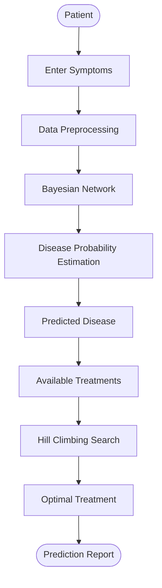

<h1 align="center">Febrile Disease Predictor</h1>

<p align="center">
Bayesian Network Based Disease Prediction with Hill Climbing Treatment Optimization
</p>

<p align="center">


</p>

---

## Overview

This project predicts **febrile diseases** from patient symptoms using a **Bayesian Network** and recommends the **most suitable treatment** using the **Hill Climbing Search Algorithm**.

---

## Features

- Bayesian Network based disease prediction
- Symptom probability estimation
- Hill Climbing treatment optimization
- Fast and lightweight implementation

---

## Workflow



---

## Project Pipeline

```text
Patient
   │
   ▼
Symptoms
   │
   ▼
Bayesian Network
   │
   ▼
Disease Prediction
   │
   ▼
Treatment Options
   │
   ▼
Hill Climbing Search
   │
   ▼
Optimal Treatment
```

---

## Technologies Used

- Python
- Bayesian Network
- Hill Climbing Search

---

## Output

- Predicted disease
- Disease probability
- Optimized treatment recommendation

---

<p align="center">
Developed as an educational project demonstrating probabilistic disease prediction and AI-based treatment optimization.
</p>
